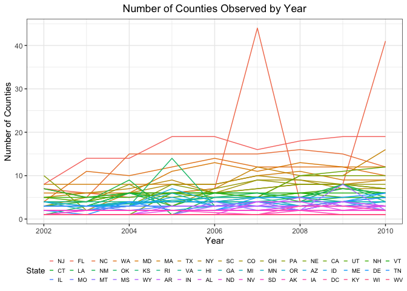

PUBH 7462 Homework 2
================
Chris Wojan
2/10/2022

### Problem 3.1

#### Data Exploration and Cleaning

Data exploration code is hidden, but data cleaning code is presented
below:

``` r
### "Clean" the data

## Make column (variable) names consistent
brfss_clean <- clean_names(brfss_data) 

## Subset the data that we are interested in
brfss_clean <- brfss_clean %>%
  separate(col = locationdesc, into = c("state", "county"), sep = " - ") %>%
  filter(topic %in% "Overall Health") %>%
  select(year, state, county, response, sample_size, data_value) %>%
  rename(num_respondents = sample_size,
         percent = data_value)

## Check if column types need to be reformatted
str(brfss_clean)

## Format variables that represent categories as factors
## (I decided not to factorize "county" because county names may be shared across states,
## having FIPS would be better)
brfss_clean <- brfss_clean %>%
  mutate(
    state = factor(state),
    response = factor(response)
  )

## Check response level order
levels(brfss_clean$response)

## Reorder response levels by ordinal position
brfss_clean$response <- fct_relevel(brfss_clean$response, 
                                    c("Excellent", "Very good", "Good", "Fair", "Poor"))
```

### Problem 3.2

#### Data Description

This cleaned BRFSS SMART dataset represents information on the
self-reported general health of survey particpants by state and county.
It includes 10625 rows (or observations) and 6 columns (or variables).
Each observation represents a particular level of general health for a
given state, county and year. The variables are as follows:

| Variable        | Description                                                   |
|-----------------|---------------------------------------------------------------|
| year            | Year of survey                                                |
| state           | US state where survey was conducted                           |
| county          | County where survey was conducted                             |
| response        | Self-reported general health status (Excellent - Poor)        |
| num_respondents | Number of respondents that reported this health status (#)    |
| percent         | Proportion of respondent that reported this health status (%) |

### Problem 3.3

#### 3.3.1

``` r
## Create a subset of the data that represent county locations
brfss_331 <- brfss_clean %>%
  filter(year %in% 2004) %>%
  select(year, state, county) %>%
  distinct()
```

The following states featured 6 surveyed counties (or locations): CO,
CT, MD, NM, SC, TX, UT, VT

#### 3.3.2

``` r
## Draw a plot of observed counties by year, spearated by state
brfss_clean %>%
  select(year, state, county) %>%
  distinct() %>%
  count(state, year, name = "counties") %>%
  mutate(state = fct_reorder(state, counties, .fun = mean, .desc = TRUE)) %>%
  ggplot() +
    geom_line(aes(x = year, y = counties, color = state)) +
    guides(color = guide_legend(title = "State", nrow = 3, byrow = TRUE)) +
    labs(x = "Year", y = "Number of Counties", title = "Number of Counties Observed by Year") +
    theme(legend.title = element_text(size = 10),
          legend.text = element_text(size = 7),
          legend.key.width = unit(2,"mm"),
          legend.key.height = unit(1, "mm"))
```

<!-- -->

The state with the highest mean number of counties observed via survey
is New Jersey, with Florida having the second highest. Overall the
number of counties observed in each state seems to increase slightly
over time. Florida exhibits a strange pattern where 40+ counties were
observed in 2007 and 2010.

#### 3.3.3

``` r
## Create a gt table of summarized, select health responses for MN in select years
brfss_clean %>%
  filter(year %in% c(2002, 2006, 2010), state %in% "MN", 
         response %in% c("Excellent", "Good", "Poor")) %>%
  group_by(year, response) %>%
  summarize(mean_num = mean(num_respondents, na.rm = TRUE),
            sd_num = sd(num_respondents, na.rm = TRUE),
            mean_percent = mean(percent, na.rm = TRUE),
            sd_percent = sd(percent, na.rm = TRUE)) %>%
  gt() %>%
  tab_header("Summary of Selected Health Responses in MN (2002, 2006, & 2010)")
```

<div id="ngkjaqabxy" style="overflow-x:auto;overflow-y:auto;width:auto;height:auto;">
<style>html {
  font-family: -apple-system, BlinkMacSystemFont, 'Segoe UI', Roboto, Oxygen, Ubuntu, Cantarell, 'Helvetica Neue', 'Fira Sans', 'Droid Sans', Arial, sans-serif;
}

#ngkjaqabxy .gt_table {
  display: table;
  border-collapse: collapse;
  margin-left: auto;
  margin-right: auto;
  color: #333333;
  font-size: 16px;
  font-weight: normal;
  font-style: normal;
  background-color: #FFFFFF;
  width: auto;
  border-top-style: solid;
  border-top-width: 2px;
  border-top-color: #A8A8A8;
  border-right-style: none;
  border-right-width: 2px;
  border-right-color: #D3D3D3;
  border-bottom-style: solid;
  border-bottom-width: 2px;
  border-bottom-color: #A8A8A8;
  border-left-style: none;
  border-left-width: 2px;
  border-left-color: #D3D3D3;
}

#ngkjaqabxy .gt_heading {
  background-color: #FFFFFF;
  text-align: center;
  border-bottom-color: #FFFFFF;
  border-left-style: none;
  border-left-width: 1px;
  border-left-color: #D3D3D3;
  border-right-style: none;
  border-right-width: 1px;
  border-right-color: #D3D3D3;
}

#ngkjaqabxy .gt_title {
  color: #333333;
  font-size: 125%;
  font-weight: initial;
  padding-top: 4px;
  padding-bottom: 4px;
  border-bottom-color: #FFFFFF;
  border-bottom-width: 0;
}

#ngkjaqabxy .gt_subtitle {
  color: #333333;
  font-size: 85%;
  font-weight: initial;
  padding-top: 0;
  padding-bottom: 6px;
  border-top-color: #FFFFFF;
  border-top-width: 0;
}

#ngkjaqabxy .gt_bottom_border {
  border-bottom-style: solid;
  border-bottom-width: 2px;
  border-bottom-color: #D3D3D3;
}

#ngkjaqabxy .gt_col_headings {
  border-top-style: solid;
  border-top-width: 2px;
  border-top-color: #D3D3D3;
  border-bottom-style: solid;
  border-bottom-width: 2px;
  border-bottom-color: #D3D3D3;
  border-left-style: none;
  border-left-width: 1px;
  border-left-color: #D3D3D3;
  border-right-style: none;
  border-right-width: 1px;
  border-right-color: #D3D3D3;
}

#ngkjaqabxy .gt_col_heading {
  color: #333333;
  background-color: #FFFFFF;
  font-size: 100%;
  font-weight: normal;
  text-transform: inherit;
  border-left-style: none;
  border-left-width: 1px;
  border-left-color: #D3D3D3;
  border-right-style: none;
  border-right-width: 1px;
  border-right-color: #D3D3D3;
  vertical-align: bottom;
  padding-top: 5px;
  padding-bottom: 6px;
  padding-left: 5px;
  padding-right: 5px;
  overflow-x: hidden;
}

#ngkjaqabxy .gt_column_spanner_outer {
  color: #333333;
  background-color: #FFFFFF;
  font-size: 100%;
  font-weight: normal;
  text-transform: inherit;
  padding-top: 0;
  padding-bottom: 0;
  padding-left: 4px;
  padding-right: 4px;
}

#ngkjaqabxy .gt_column_spanner_outer:first-child {
  padding-left: 0;
}

#ngkjaqabxy .gt_column_spanner_outer:last-child {
  padding-right: 0;
}

#ngkjaqabxy .gt_column_spanner {
  border-bottom-style: solid;
  border-bottom-width: 2px;
  border-bottom-color: #D3D3D3;
  vertical-align: bottom;
  padding-top: 5px;
  padding-bottom: 5px;
  overflow-x: hidden;
  display: inline-block;
  width: 100%;
}

#ngkjaqabxy .gt_group_heading {
  padding: 8px;
  color: #333333;
  background-color: #FFFFFF;
  font-size: 100%;
  font-weight: initial;
  text-transform: inherit;
  border-top-style: solid;
  border-top-width: 2px;
  border-top-color: #D3D3D3;
  border-bottom-style: solid;
  border-bottom-width: 2px;
  border-bottom-color: #D3D3D3;
  border-left-style: none;
  border-left-width: 1px;
  border-left-color: #D3D3D3;
  border-right-style: none;
  border-right-width: 1px;
  border-right-color: #D3D3D3;
  vertical-align: middle;
}

#ngkjaqabxy .gt_empty_group_heading {
  padding: 0.5px;
  color: #333333;
  background-color: #FFFFFF;
  font-size: 100%;
  font-weight: initial;
  border-top-style: solid;
  border-top-width: 2px;
  border-top-color: #D3D3D3;
  border-bottom-style: solid;
  border-bottom-width: 2px;
  border-bottom-color: #D3D3D3;
  vertical-align: middle;
}

#ngkjaqabxy .gt_from_md > :first-child {
  margin-top: 0;
}

#ngkjaqabxy .gt_from_md > :last-child {
  margin-bottom: 0;
}

#ngkjaqabxy .gt_row {
  padding-top: 8px;
  padding-bottom: 8px;
  padding-left: 5px;
  padding-right: 5px;
  margin: 10px;
  border-top-style: solid;
  border-top-width: 1px;
  border-top-color: #D3D3D3;
  border-left-style: none;
  border-left-width: 1px;
  border-left-color: #D3D3D3;
  border-right-style: none;
  border-right-width: 1px;
  border-right-color: #D3D3D3;
  vertical-align: middle;
  overflow-x: hidden;
}

#ngkjaqabxy .gt_stub {
  color: #333333;
  background-color: #FFFFFF;
  font-size: 100%;
  font-weight: initial;
  text-transform: inherit;
  border-right-style: solid;
  border-right-width: 2px;
  border-right-color: #D3D3D3;
  padding-left: 12px;
}

#ngkjaqabxy .gt_summary_row {
  color: #333333;
  background-color: #FFFFFF;
  text-transform: inherit;
  padding-top: 8px;
  padding-bottom: 8px;
  padding-left: 5px;
  padding-right: 5px;
}

#ngkjaqabxy .gt_first_summary_row {
  padding-top: 8px;
  padding-bottom: 8px;
  padding-left: 5px;
  padding-right: 5px;
  border-top-style: solid;
  border-top-width: 2px;
  border-top-color: #D3D3D3;
}

#ngkjaqabxy .gt_grand_summary_row {
  color: #333333;
  background-color: #FFFFFF;
  text-transform: inherit;
  padding-top: 8px;
  padding-bottom: 8px;
  padding-left: 5px;
  padding-right: 5px;
}

#ngkjaqabxy .gt_first_grand_summary_row {
  padding-top: 8px;
  padding-bottom: 8px;
  padding-left: 5px;
  padding-right: 5px;
  border-top-style: double;
  border-top-width: 6px;
  border-top-color: #D3D3D3;
}

#ngkjaqabxy .gt_striped {
  background-color: rgba(128, 128, 128, 0.05);
}

#ngkjaqabxy .gt_table_body {
  border-top-style: solid;
  border-top-width: 2px;
  border-top-color: #D3D3D3;
  border-bottom-style: solid;
  border-bottom-width: 2px;
  border-bottom-color: #D3D3D3;
}

#ngkjaqabxy .gt_footnotes {
  color: #333333;
  background-color: #FFFFFF;
  border-bottom-style: none;
  border-bottom-width: 2px;
  border-bottom-color: #D3D3D3;
  border-left-style: none;
  border-left-width: 2px;
  border-left-color: #D3D3D3;
  border-right-style: none;
  border-right-width: 2px;
  border-right-color: #D3D3D3;
}

#ngkjaqabxy .gt_footnote {
  margin: 0px;
  font-size: 90%;
  padding: 4px;
}

#ngkjaqabxy .gt_sourcenotes {
  color: #333333;
  background-color: #FFFFFF;
  border-bottom-style: none;
  border-bottom-width: 2px;
  border-bottom-color: #D3D3D3;
  border-left-style: none;
  border-left-width: 2px;
  border-left-color: #D3D3D3;
  border-right-style: none;
  border-right-width: 2px;
  border-right-color: #D3D3D3;
}

#ngkjaqabxy .gt_sourcenote {
  font-size: 90%;
  padding: 4px;
}

#ngkjaqabxy .gt_left {
  text-align: left;
}

#ngkjaqabxy .gt_center {
  text-align: center;
}

#ngkjaqabxy .gt_right {
  text-align: right;
  font-variant-numeric: tabular-nums;
}

#ngkjaqabxy .gt_font_normal {
  font-weight: normal;
}

#ngkjaqabxy .gt_font_bold {
  font-weight: bold;
}

#ngkjaqabxy .gt_font_italic {
  font-style: italic;
}

#ngkjaqabxy .gt_super {
  font-size: 65%;
}

#ngkjaqabxy .gt_footnote_marks {
  font-style: italic;
  font-weight: normal;
  font-size: 65%;
}
</style>
<table class="gt_table">
  <thead class="gt_header">
    <tr>
      <th colspan="5" class="gt_heading gt_title gt_font_normal gt_bottom_border" style>Summary of Selected Health Responses in MN (2002, 2006, &amp; 2010)</th>
    </tr>
    
  </thead>
  <thead class="gt_col_headings">
    <tr>
      <th class="gt_col_heading gt_columns_bottom_border gt_center" rowspan="1" colspan="1">response</th>
      <th class="gt_col_heading gt_columns_bottom_border gt_right" rowspan="1" colspan="1">mean_num</th>
      <th class="gt_col_heading gt_columns_bottom_border gt_right" rowspan="1" colspan="1">sd_num</th>
      <th class="gt_col_heading gt_columns_bottom_border gt_right" rowspan="1" colspan="1">mean_percent</th>
      <th class="gt_col_heading gt_columns_bottom_border gt_right" rowspan="1" colspan="1">sd_percent</th>
    </tr>
  </thead>
  <tbody class="gt_table_body">
    <tr class="gt_group_heading_row">
      <td colspan="5" class="gt_group_heading">2002</td>
    </tr>
    <tr><td class="gt_row gt_center">Excellent</td>
<td class="gt_row gt_right">116.00</td>
<td class="gt_row gt_right">83.275</td>
<td class="gt_row gt_right">24.15</td>
<td class="gt_row gt_right">3.5407</td></tr>
    <tr><td class="gt_row gt_center">Good</td>
<td class="gt_row gt_right">123.75</td>
<td class="gt_row gt_right">84.263</td>
<td class="gt_row gt_right">23.95</td>
<td class="gt_row gt_right">1.0472</td></tr>
    <tr><td class="gt_row gt_center">Poor</td>
<td class="gt_row gt_right">13.75</td>
<td class="gt_row gt_right">9.570</td>
<td class="gt_row gt_right">2.40</td>
<td class="gt_row gt_right">1.1690</td></tr>
    <tr class="gt_group_heading_row">
      <td colspan="5" class="gt_group_heading">2006</td>
    </tr>
    <tr><td class="gt_row gt_center">Excellent</td>
<td class="gt_row gt_right">122.33</td>
<td class="gt_row gt_right">72.625</td>
<td class="gt_row gt_right">23.83</td>
<td class="gt_row gt_right">2.9872</td></tr>
    <tr><td class="gt_row gt_center">Good</td>
<td class="gt_row gt_right">137.33</td>
<td class="gt_row gt_right">85.816</td>
<td class="gt_row gt_right">26.37</td>
<td class="gt_row gt_right">0.4509</td></tr>
    <tr><td class="gt_row gt_center">Poor</td>
<td class="gt_row gt_right">15.00</td>
<td class="gt_row gt_right">6.928</td>
<td class="gt_row gt_right">2.30</td>
<td class="gt_row gt_right">0.9539</td></tr>
    <tr class="gt_group_heading_row">
      <td colspan="5" class="gt_group_heading">2010</td>
    </tr>
    <tr><td class="gt_row gt_center">Excellent</td>
<td class="gt_row gt_right">203.80</td>
<td class="gt_row gt_right">190.598</td>
<td class="gt_row gt_right">25.44</td>
<td class="gt_row gt_right">5.2776</td></tr>
    <tr><td class="gt_row gt_center">Good</td>
<td class="gt_row gt_right">220.00</td>
<td class="gt_row gt_right">196.099</td>
<td class="gt_row gt_right">26.04</td>
<td class="gt_row gt_right">3.5473</td></tr>
    <tr><td class="gt_row gt_center">Poor</td>
<td class="gt_row gt_right">27.40</td>
<td class="gt_row gt_right">27.318</td>
<td class="gt_row gt_right">2.36</td>
<td class="gt_row gt_right">0.7701</td></tr>
  </tbody>
  
  
</table>
</div>

Overall, the three different years show fairly similar results for each
response type. Across years, “Poor” responses comprise 2-2.5% of
responses averaged across MN, while “Excellent” and “Good” each comprise
about a quarter of responses. Finally, the proportion of “Excellent”
responses appears to vary more widely from county to county in MN as
compared to “Good and”Poor” responses, as evidenced by the consistently
higher standard deviation observed.

### 3.3.4
