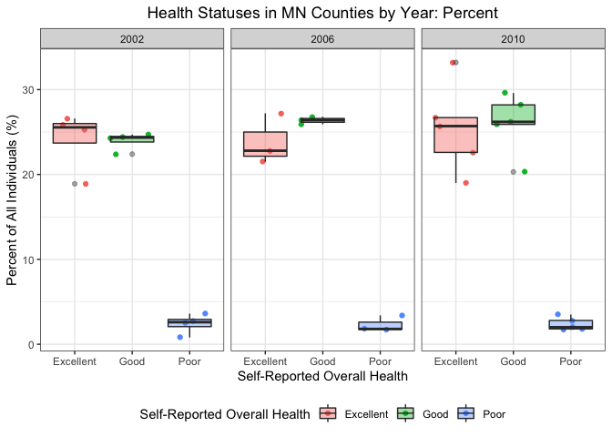

PUBH 7462 Homework 2
================
Chris Wojan
2/10/2022

### Problem 3.1

#### Data Exploration and Cleaning

Data exploration code is hidden, but data cleaning code is presented
below:

``` r
### "Clean" the data

## Make column (variable) names consistent
brfss_clean <- clean_names(brfss_data) 

## Subset the data that we are interested in
brfss_clean <- brfss_clean %>%
  ## First separate location description into state and county
  ## (because the problem says county needs to be "extracted")
  ## ("state" is a double of location abbreviation, but that is excluded later)
  separate(col = locationdesc, into = c("state", "county"), sep = " - ") %>% 
  ## Then filter only by the Overall Health question
  filter(topic %in% "Overall Health") %>%
  ## Select only the columns of interest
  select(year, state, county, response, sample_size, data_value) %>%
  ## Rename the value variables more meaningfully
  rename(num_respondents = sample_size,
         percent = data_value)

## Check if column types need to be reformatted
str(brfss_clean)

## Format variables that represent categories as factors
## (I decided not to factorize "county" because county names may be shared across states,
## having FIPS would be better)
brfss_clean <- brfss_clean %>%
  mutate(
    state = factor(state),
    response = factor(response)
  )

## Check response level order
levels(brfss_clean$response)

## Reorder response levels by ordinal position
brfss_clean$response <- fct_relevel(brfss_clean$response, 
                                    c("Excellent", "Very good", "Good", "Fair", "Poor"))
```

### Problem 3.2

#### Data Description

This cleaned BRFSS SMART dataset represents information on the
self-reported general health of survey particpants by state and county.
It includes 10625 rows (or observations) and 6 columns (or variables).
Each observation represents a particular level of general health for a
given state, county and year. The variables are as follows:

| Variable        | Description                                                   |
|-----------------|---------------------------------------------------------------|
| year            | Year of survey                                                |
| state           | US state where survey was conducted                           |
| county          | County where survey was conducted                             |
| response        | Self-reported general health status (Excellent - Poor)        |
| num_respondents | Number of respondents that reported this health status (#)    |
| percent         | Proportion of respondent that reported this health status (%) |

### Problem 3.3

#### 3.3.1

``` r
## Create a subset of the data that represent county locations by year and state
brfss_331 <- brfss_clean %>%
  ## Filter only data from 2004
  filter(year %in% 2004) %>%
  ## Exclude the response types and values
  select(year, state, county) %>%
  ## "Collapse" the data into only unique rows
  distinct()
```

The following states featured 6 surveyed counties (or locations) in
2004: CO, CT, MD, NM, SC, TX, UT, VT

#### 3.3.2

``` r
## Draw a plot of observed counties by year, separated by state
brfss_clean %>%
  ## Take only the year, state, and county observed
  select(year, state, county) %>% 
  ## And only the unique combinations
  distinct() %>%
  ## Count all counties observed by state and year
  count(state, year, name = "counties") %>%
  ## Reorder the state factor by mean number of counties observed over time
  mutate(state = fct_reorder(state, counties, .fun = mean, .desc = TRUE)) %>%
  ## Start drawing plot
  ggplot() +
    geom_line(aes(x = year, y = counties, color = state)) +
    guides(color = guide_legend(title = "State", nrow = 3, byrow = TRUE)) +
    labs(x = "Year", y = "Number of Counties", title = "Number of Counties Observed by Year") +
    theme(legend.title = element_text(size = 10),
          legend.text = element_text(size = 7),
          legend.key.width = unit(2,"mm"),
          legend.key.height = unit(1, "mm"))
```

<!-- -->

The state with the highest mean number of counties observed via survey
is New Jersey, with Florida having the second highest. Overall the
number of counties observed in each state seems to increase slightly
over time. Florida exhibits a strange pattern where 40+ counties were
observed in 2007 and 2010, which is many more than usual.

#### 3.3.3

``` r
## Create a gt table of summarized, select health responses for MN in select years
brfss_clean %>%
  ## Filter only MN data from 2002, 2006, and 2004; of only three response types
  filter(year %in% c(2002, 2006, 2010), state %in% "MN", 
         response %in% c("Excellent", "Good", "Poor")) %>%
  ## For each year, find the mean and SD of respondent number and percent for each response type
  ## (across all counties in MN)
  group_by(year, response) %>%
  summarize(mean_num = mean(num_respondents, na.rm = TRUE),
            sd_num = sd(num_respondents, na.rm = TRUE),
            mean_percent = mean(percent, na.rm = TRUE),
            sd_percent = sd(percent, na.rm = TRUE)) %>%
  ## Display in table
  gt() %>%
  tab_header("Summary of Selected Health Responses in MN (2002, 2006, & 2010)")
```

<div id="qxczbnmwnk" style="overflow-x:auto;overflow-y:auto;width:auto;height:auto;">
<style>html {
  font-family: -apple-system, BlinkMacSystemFont, 'Segoe UI', Roboto, Oxygen, Ubuntu, Cantarell, 'Helvetica Neue', 'Fira Sans', 'Droid Sans', Arial, sans-serif;
}

#qxczbnmwnk .gt_table {
  display: table;
  border-collapse: collapse;
  margin-left: auto;
  margin-right: auto;
  color: #333333;
  font-size: 16px;
  font-weight: normal;
  font-style: normal;
  background-color: #FFFFFF;
  width: auto;
  border-top-style: solid;
  border-top-width: 2px;
  border-top-color: #A8A8A8;
  border-right-style: none;
  border-right-width: 2px;
  border-right-color: #D3D3D3;
  border-bottom-style: solid;
  border-bottom-width: 2px;
  border-bottom-color: #A8A8A8;
  border-left-style: none;
  border-left-width: 2px;
  border-left-color: #D3D3D3;
}

#qxczbnmwnk .gt_heading {
  background-color: #FFFFFF;
  text-align: center;
  border-bottom-color: #FFFFFF;
  border-left-style: none;
  border-left-width: 1px;
  border-left-color: #D3D3D3;
  border-right-style: none;
  border-right-width: 1px;
  border-right-color: #D3D3D3;
}

#qxczbnmwnk .gt_title {
  color: #333333;
  font-size: 125%;
  font-weight: initial;
  padding-top: 4px;
  padding-bottom: 4px;
  border-bottom-color: #FFFFFF;
  border-bottom-width: 0;
}

#qxczbnmwnk .gt_subtitle {
  color: #333333;
  font-size: 85%;
  font-weight: initial;
  padding-top: 0;
  padding-bottom: 6px;
  border-top-color: #FFFFFF;
  border-top-width: 0;
}

#qxczbnmwnk .gt_bottom_border {
  border-bottom-style: solid;
  border-bottom-width: 2px;
  border-bottom-color: #D3D3D3;
}

#qxczbnmwnk .gt_col_headings {
  border-top-style: solid;
  border-top-width: 2px;
  border-top-color: #D3D3D3;
  border-bottom-style: solid;
  border-bottom-width: 2px;
  border-bottom-color: #D3D3D3;
  border-left-style: none;
  border-left-width: 1px;
  border-left-color: #D3D3D3;
  border-right-style: none;
  border-right-width: 1px;
  border-right-color: #D3D3D3;
}

#qxczbnmwnk .gt_col_heading {
  color: #333333;
  background-color: #FFFFFF;
  font-size: 100%;
  font-weight: normal;
  text-transform: inherit;
  border-left-style: none;
  border-left-width: 1px;
  border-left-color: #D3D3D3;
  border-right-style: none;
  border-right-width: 1px;
  border-right-color: #D3D3D3;
  vertical-align: bottom;
  padding-top: 5px;
  padding-bottom: 6px;
  padding-left: 5px;
  padding-right: 5px;
  overflow-x: hidden;
}

#qxczbnmwnk .gt_column_spanner_outer {
  color: #333333;
  background-color: #FFFFFF;
  font-size: 100%;
  font-weight: normal;
  text-transform: inherit;
  padding-top: 0;
  padding-bottom: 0;
  padding-left: 4px;
  padding-right: 4px;
}

#qxczbnmwnk .gt_column_spanner_outer:first-child {
  padding-left: 0;
}

#qxczbnmwnk .gt_column_spanner_outer:last-child {
  padding-right: 0;
}

#qxczbnmwnk .gt_column_spanner {
  border-bottom-style: solid;
  border-bottom-width: 2px;
  border-bottom-color: #D3D3D3;
  vertical-align: bottom;
  padding-top: 5px;
  padding-bottom: 5px;
  overflow-x: hidden;
  display: inline-block;
  width: 100%;
}

#qxczbnmwnk .gt_group_heading {
  padding: 8px;
  color: #333333;
  background-color: #FFFFFF;
  font-size: 100%;
  font-weight: initial;
  text-transform: inherit;
  border-top-style: solid;
  border-top-width: 2px;
  border-top-color: #D3D3D3;
  border-bottom-style: solid;
  border-bottom-width: 2px;
  border-bottom-color: #D3D3D3;
  border-left-style: none;
  border-left-width: 1px;
  border-left-color: #D3D3D3;
  border-right-style: none;
  border-right-width: 1px;
  border-right-color: #D3D3D3;
  vertical-align: middle;
}

#qxczbnmwnk .gt_empty_group_heading {
  padding: 0.5px;
  color: #333333;
  background-color: #FFFFFF;
  font-size: 100%;
  font-weight: initial;
  border-top-style: solid;
  border-top-width: 2px;
  border-top-color: #D3D3D3;
  border-bottom-style: solid;
  border-bottom-width: 2px;
  border-bottom-color: #D3D3D3;
  vertical-align: middle;
}

#qxczbnmwnk .gt_from_md > :first-child {
  margin-top: 0;
}

#qxczbnmwnk .gt_from_md > :last-child {
  margin-bottom: 0;
}

#qxczbnmwnk .gt_row {
  padding-top: 8px;
  padding-bottom: 8px;
  padding-left: 5px;
  padding-right: 5px;
  margin: 10px;
  border-top-style: solid;
  border-top-width: 1px;
  border-top-color: #D3D3D3;
  border-left-style: none;
  border-left-width: 1px;
  border-left-color: #D3D3D3;
  border-right-style: none;
  border-right-width: 1px;
  border-right-color: #D3D3D3;
  vertical-align: middle;
  overflow-x: hidden;
}

#qxczbnmwnk .gt_stub {
  color: #333333;
  background-color: #FFFFFF;
  font-size: 100%;
  font-weight: initial;
  text-transform: inherit;
  border-right-style: solid;
  border-right-width: 2px;
  border-right-color: #D3D3D3;
  padding-left: 12px;
}

#qxczbnmwnk .gt_summary_row {
  color: #333333;
  background-color: #FFFFFF;
  text-transform: inherit;
  padding-top: 8px;
  padding-bottom: 8px;
  padding-left: 5px;
  padding-right: 5px;
}

#qxczbnmwnk .gt_first_summary_row {
  padding-top: 8px;
  padding-bottom: 8px;
  padding-left: 5px;
  padding-right: 5px;
  border-top-style: solid;
  border-top-width: 2px;
  border-top-color: #D3D3D3;
}

#qxczbnmwnk .gt_grand_summary_row {
  color: #333333;
  background-color: #FFFFFF;
  text-transform: inherit;
  padding-top: 8px;
  padding-bottom: 8px;
  padding-left: 5px;
  padding-right: 5px;
}

#qxczbnmwnk .gt_first_grand_summary_row {
  padding-top: 8px;
  padding-bottom: 8px;
  padding-left: 5px;
  padding-right: 5px;
  border-top-style: double;
  border-top-width: 6px;
  border-top-color: #D3D3D3;
}

#qxczbnmwnk .gt_striped {
  background-color: rgba(128, 128, 128, 0.05);
}

#qxczbnmwnk .gt_table_body {
  border-top-style: solid;
  border-top-width: 2px;
  border-top-color: #D3D3D3;
  border-bottom-style: solid;
  border-bottom-width: 2px;
  border-bottom-color: #D3D3D3;
}

#qxczbnmwnk .gt_footnotes {
  color: #333333;
  background-color: #FFFFFF;
  border-bottom-style: none;
  border-bottom-width: 2px;
  border-bottom-color: #D3D3D3;
  border-left-style: none;
  border-left-width: 2px;
  border-left-color: #D3D3D3;
  border-right-style: none;
  border-right-width: 2px;
  border-right-color: #D3D3D3;
}

#qxczbnmwnk .gt_footnote {
  margin: 0px;
  font-size: 90%;
  padding: 4px;
}

#qxczbnmwnk .gt_sourcenotes {
  color: #333333;
  background-color: #FFFFFF;
  border-bottom-style: none;
  border-bottom-width: 2px;
  border-bottom-color: #D3D3D3;
  border-left-style: none;
  border-left-width: 2px;
  border-left-color: #D3D3D3;
  border-right-style: none;
  border-right-width: 2px;
  border-right-color: #D3D3D3;
}

#qxczbnmwnk .gt_sourcenote {
  font-size: 90%;
  padding: 4px;
}

#qxczbnmwnk .gt_left {
  text-align: left;
}

#qxczbnmwnk .gt_center {
  text-align: center;
}

#qxczbnmwnk .gt_right {
  text-align: right;
  font-variant-numeric: tabular-nums;
}

#qxczbnmwnk .gt_font_normal {
  font-weight: normal;
}

#qxczbnmwnk .gt_font_bold {
  font-weight: bold;
}

#qxczbnmwnk .gt_font_italic {
  font-style: italic;
}

#qxczbnmwnk .gt_super {
  font-size: 65%;
}

#qxczbnmwnk .gt_footnote_marks {
  font-style: italic;
  font-weight: normal;
  font-size: 65%;
}
</style>
<table class="gt_table">
  <thead class="gt_header">
    <tr>
      <th colspan="5" class="gt_heading gt_title gt_font_normal gt_bottom_border" style>Summary of Selected Health Responses in MN (2002, 2006, &amp; 2010)</th>
    </tr>
    
  </thead>
  <thead class="gt_col_headings">
    <tr>
      <th class="gt_col_heading gt_columns_bottom_border gt_center" rowspan="1" colspan="1">response</th>
      <th class="gt_col_heading gt_columns_bottom_border gt_right" rowspan="1" colspan="1">mean_num</th>
      <th class="gt_col_heading gt_columns_bottom_border gt_right" rowspan="1" colspan="1">sd_num</th>
      <th class="gt_col_heading gt_columns_bottom_border gt_right" rowspan="1" colspan="1">mean_percent</th>
      <th class="gt_col_heading gt_columns_bottom_border gt_right" rowspan="1" colspan="1">sd_percent</th>
    </tr>
  </thead>
  <tbody class="gt_table_body">
    <tr class="gt_group_heading_row">
      <td colspan="5" class="gt_group_heading">2002</td>
    </tr>
    <tr><td class="gt_row gt_center">Excellent</td>
<td class="gt_row gt_right">116.00</td>
<td class="gt_row gt_right">83.275</td>
<td class="gt_row gt_right">24.15</td>
<td class="gt_row gt_right">3.5407</td></tr>
    <tr><td class="gt_row gt_center">Good</td>
<td class="gt_row gt_right">123.75</td>
<td class="gt_row gt_right">84.263</td>
<td class="gt_row gt_right">23.95</td>
<td class="gt_row gt_right">1.0472</td></tr>
    <tr><td class="gt_row gt_center">Poor</td>
<td class="gt_row gt_right">13.75</td>
<td class="gt_row gt_right">9.570</td>
<td class="gt_row gt_right">2.40</td>
<td class="gt_row gt_right">1.1690</td></tr>
    <tr class="gt_group_heading_row">
      <td colspan="5" class="gt_group_heading">2006</td>
    </tr>
    <tr><td class="gt_row gt_center">Excellent</td>
<td class="gt_row gt_right">122.33</td>
<td class="gt_row gt_right">72.625</td>
<td class="gt_row gt_right">23.83</td>
<td class="gt_row gt_right">2.9872</td></tr>
    <tr><td class="gt_row gt_center">Good</td>
<td class="gt_row gt_right">137.33</td>
<td class="gt_row gt_right">85.816</td>
<td class="gt_row gt_right">26.37</td>
<td class="gt_row gt_right">0.4509</td></tr>
    <tr><td class="gt_row gt_center">Poor</td>
<td class="gt_row gt_right">15.00</td>
<td class="gt_row gt_right">6.928</td>
<td class="gt_row gt_right">2.30</td>
<td class="gt_row gt_right">0.9539</td></tr>
    <tr class="gt_group_heading_row">
      <td colspan="5" class="gt_group_heading">2010</td>
    </tr>
    <tr><td class="gt_row gt_center">Excellent</td>
<td class="gt_row gt_right">203.80</td>
<td class="gt_row gt_right">190.598</td>
<td class="gt_row gt_right">25.44</td>
<td class="gt_row gt_right">5.2776</td></tr>
    <tr><td class="gt_row gt_center">Good</td>
<td class="gt_row gt_right">220.00</td>
<td class="gt_row gt_right">196.099</td>
<td class="gt_row gt_right">26.04</td>
<td class="gt_row gt_right">3.5473</td></tr>
    <tr><td class="gt_row gt_center">Poor</td>
<td class="gt_row gt_right">27.40</td>
<td class="gt_row gt_right">27.318</td>
<td class="gt_row gt_right">2.36</td>
<td class="gt_row gt_right">0.7701</td></tr>
  </tbody>
  
  
</table>
</div>

Overall, the three different years show fairly similar results for each
response type. Across years, “Poor” responses comprise 2-2.5% of
responses averaged across MN, while “Excellent” and “Good” each comprise
about a quarter of responses. Finally, the proportion of “Excellent”
responses appears to vary more widely from county to county in MN as
compared to “Good and”Poor” responses, as evidenced by the consistently
higher standard deviation observed.

### 3.3.4

Note: two plots are included because displaying two types of numeric
values that aren’t a one-to-one transformation (in this case raw numbers
and percentages) in a single plot is not advised.

``` r
## Draw a plot of number of respondents for select health responses, select years, in MN
brfss_clean %>%
  ## Filter only MN data from 2002, 2006, and 2004; of only three response types
  filter(year %in% c(2002, 2006, 2010), state %in% "MN", 
         response %in% c("Excellent", "Good", "Poor")) %>%
  ## Start drawing plot
  ggplot() +
    geom_jitter(aes(x = response, y = num_respondents, color = response)) +
    geom_boxplot(aes(x = response, y = num_respondents, fill = response), alpha = 0.4) +
    facet_wrap(vars(year)) +
    labs(x = "Response Type", y = "Number of Respondents", 
         title = "Number of Selected Health Responses in Minnesota by Year") +
    guides(color = guide_legend(title = "Response Type"),
           fill = guide_legend(title = "Response Type"))
```

<!-- -->

``` r
## Draw a plot of percent of respondents for select health responses, select years, in MN
brfss_clean %>%
  ## Filter only MN data from 2002, 2006, and 2004; of only three response types
  filter(year %in% c(2002, 2006, 2010), state %in% "MN", 
         response %in% c("Excellent", "Good", "Poor")) %>%
  ## Start drawing plot
  ggplot() +
    geom_jitter(aes(x = response, y = percent, color = response)) +
    geom_boxplot(aes(x = response, y = percent, fill = response), alpha = 0.4) +
    facet_wrap(vars(year)) +
    labs(x = "Response Type", y = "Percent of Respondents", 
         title = "Percent of Selected Health Responses in Minnesota by Year") +
    guides(color = guide_legend(title = "Response Type"),
           fill = guide_legend(title = "Response Type"))
```

<!-- -->
